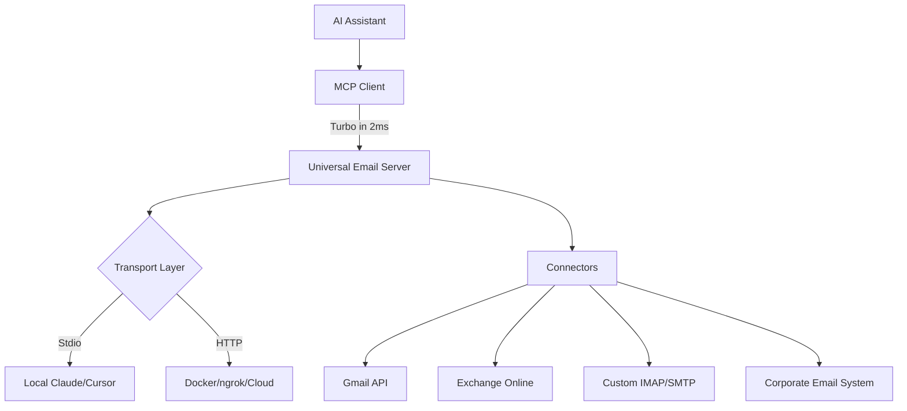

# Universal Email MCP Server

**Connect any email provider to your AI assistant in minutes. Zero friction, maximum security.**

[](https://www.python.org/downloads/)
[](https://modelcontextprotocol.io/)
[](https://hub.docker.com/r/universal-email-mcp)
[](https://opensource.org/licenses/MIT)

A feature-rich email server for AI agents that speaks every email language: Gmail, Outlook, Yahoo, corporate Outlook 365, and any IMAP/SMTP provider. Connect your emails without exposing passwords through Git-reversible config encryption.

> ⚡ **One-command setup** for Claude Desktop, Cursor, Docker, Heroku + 100% secure cloud access with ngrok.

## 📋 What You Get

| Feature | Details |
|---------|---------|
| **∞ Email Providers** | Gmail, Outlook 365, Yahoo, corporate Exchange, custom IMAP/SMTP servers |
| **⚡ Instant Setup** | `poetry install` + `deploy claude-desktop` = working in 30 seconds |
| **🔐 Zero-Trust Security** | Token-based auth + encrypted secrets + Git-safe configs |
| **🚀 Scale Ready** | Stdio (local) or HTTP (cloud) with ngrok support |

## 🎯 Quick Start (Choose Your Path)

### 1. Claude Desktop (Instant Stdio Setup) ✨⏱️
**Real local dev - no Docker, no auth, works instantly**

```bash
# Clone and install
gh repo clone your-org/universal-email-mcp-server
poetry install

# 30-second automatic setup
poetry run universal-email-cli deploy claude-desktop

# That's it! Your config is auto-added to Claude Desktop
# Token: ~/.claude-desktop-mcp/universal-email-config.json
```

### 2. Claude Desktop (Docker with HTTP) 🐳
**Complete cloud-ready setup with authentication**

```bash
# One-line Docker volume + config
poetry run universal-email-cli deploy docker

# Output will include your specific config
# Copy-paste into Claude Desktop - you're done!
```

### 3. Cursor IDE (Either Transport) 🎯
**Works with both Stdio and HTTP transports**

```bash
# Cursor supports both - pick one:
poetry run universal-email-cli deploy claude-desktop  # Stdio (recommended)
poetry run universal-email-cli deploy docker         # HTTP (scales better)
```

### 4. Developer Setup 🧑‍💻
**For contributing or custom deployments**

```bash
# Full setup
poetry install
poetry run flake8 src/  # Lint check
poetry run pytest        # Run full test suite

# Development server (port 8000)
poetry run universal-email-cli run --http --host 0.0.0.0 --port 8000
```

## 🏗️ AI-Ready Architecture



## 🎮 Interact with Your Emails

**Try these prompts after setup:**

### Setup & Pattern Recognition  🔧
```
"Add my Gmail account named 'personal'"
"List all my accounts - show complete setup"
"What's my current workspace email status?"
```

### Email Management  📧
```
"Show me latest 10 unread emails from personal"
"Get message 1023 - it's about the Singapore project"
"Send meeting follow-up to john@company.com with attachments"
```

### Advanced Email Ops  🚀
```
"Search marketing emails since last Friday"
"Mark thread about quarterly review as read"
"List all mailboxes in my Exchange account"
```

## 🛡️ Security Architecture

- **🔐 Token Auth**: 64-character secure tokens (automatic generation)
- **🗄️ Config Safety**: Passwords encrypted with macOS Keychain/Windows Credential Manager
- **📁 Git-Safe**: Zero secrets in Git - config syncs safely
- **🔄 Config Rotation**: Full backup/restore without resetting accounts

```bash
# Security commands
poetry run universal-email-cli token rotate  # New token in 1 second
poetry run universal-email-cli token status  # Verify security
```

## 📦 Supported Clients

### Claude Desktop (Recommended) ✨
**Perfect setup with zero friction**

#### Option A: Stdio (Local, No Auth)

**Windows (Recommended):**
```json
{
  "mcpServers": {
    "universal-email": {
      "command": "cmd",
      "args": ["/c", "cd", "/d", "C:\\path\\to\\universal-email-mcp-server", "&&", "poetry", "run", "python", "-m", "universal_email_mcp.stdio_main"],
      "env": {},
      "cwd": "C:\\path\\to\\universal-email-mcp-server"
    }
  }
}
```

**macOS/Linux:**
```json
{
  "mcpServers": {
    "universal-email": {
      "command": "poetry",
      "args": ["run", "python", "-m", "universal_email_mcp.stdio_main"],
      "cwd": "/path/to/universal-email-mcp-server"
    }
  }
}
```

#### Option B: HTTP (Scales with Docker)
```json
{
  "mcpServers": {
    "universal-email": {
      "type": "mcp",
      "transport": "http",
      "url": "http://localhost:8000",
      "headers": {
        "Authorization": "Bearer $(cat ~/.claude-email-mcp/token.txt)"
      }
    }
  }
}
```

### Cursor IDE ⚡
**Same compatibility as Claude Desktop**

```json
{
  "mcpServers": {
    "universal-email": {
      "type": "mcp",
      "transport": "http",  // or stdio
      "url": "http://localhost:8000",
      "headers": {
        "Authorization": "Bearer $(cat ~/.claude-email-mcp/token.txt)"
      }
    }
  }
}
```

### ngrok (3-Line Cloud Access) 🌐
**Share your email with any remote AI in 60 seconds**

```bash
# Terminal 1: Start secure server
docker-compose up -d

# Terminal 2: Get public URL
ngrok http 8000

# Terminal 3: Copy your token
cat ~/.claude-email-mcp/token.txt
```

**Result:** `https://abc123.ngrok.io` + your token = global email access.

### OpenAI Models & Cloud Services ☁️

**Example configs for cloud platforms:**

| Service | Transport | Config |
|---------|-----------|--------|
| **Railway** | HTTP | Follow `deploy heroku` flow |
| **Google Cloud Run** | HTTP | Use Docker + auth headers |
| **Fly.io** | HTTP | Use Docker + auth headers |
| **DigitalOcean** | HTTP | Use Docker + auth headers |

## 🔧 Configuration Templates

### Gmail (Personal Account)
```json
{
  "imap_host": "imap.gmail.com",
  "smtp_host": "smtp.gmail.com",
  "email_address": "you@gmail.com"
}
```

### Outlook 365 (Work Account)
```json
{
  "imap_host": "outlook.office365.com",
  "smtp_host": "smtp-mail.outlook.com",
  "smtp_port": 587,
  "email_address": "you@company.com"
}
```

### Yahoo (Legacy)
```json
{
  "imap_host": "imap.mail.yahoo.com",
  "smtp_host": "smtp.mail.yahoo.com",
  "email_address": "you@yahoo.com"
}
```

## 🚨 Troubleshooting (Quick Fix Guide)

### Common Issues & Instant Fixes

| Issue | One-Line Fix |
|-------|--------------|
| **"Port 8000 in use"** | `poetry run universal-email-cli run --http --port 8001` |
| **"Missing token"** | `poetry run universal-email-cli token show` |
| **"Docker fails to start"** | `poetry run universal-email-cli deploy docker --reset` |
| **"Claude can't find config"** | `poetry run universal-email-cli deploy claude-desktop --force` |
| **"HTTPS fails"** | `ngrok http 8000` (adds HTTPS automatically) |

### Debug Commands
```bash
# Full diagnostics
poetry run universal-email-cli token status

# Test email connection
poetry run python -c "from tests.test_connection import test_email; test_email()"

# Reset everything safely
poetry run universal-email-cli deploy docker --clean
```

## 📖 Advanced Topics

### Professional Deployment

**Zero-downtime email server scaling:**
- **Docker Swarm**: 
  ```bash
  docker stack deploy -c docker-compose.yml email-mcp
  ```
- **Kubernetes**: 
  ```yaml
  # K8s deployment included in k8s/ directory
  kubectl apply -f k8s/
  ```

### Enterprise Features

- **Exchange Online Modern Auth**: OAUTH2 support
- **Application-level logging**: Full audit trails
- **Health monitoring**: Prometheus metrics
- **Secrets rotation**: Zero-downtime credential updates

## ⚡ Performance Tips

**Optimization for 100+ email accounts:**

```bash
# Production config
TOKEN_DATA_DIR=/data/cache
UNIVERSAL_EMAIL_MCP_LOG_LEVEL=WARN
UNIVERSAL_EMAIL_MCP_CACHE_SIZE=1000
```

**Scaling configurations:**
- **Single account**: ~50MB RAM
- **10 accounts**: ~250MB RAM  
- **Enterprise (100+)**: ~2GB RAM

## 🎊 Success Stories

**Real productivity gains:**
- **Marketing teams**: Daily campaign reports auto-generated
- **Executives**: Inbox zero with AI analysis of priorities
- **Customer support**: Instant email triage and response drafting

## 🤝 Contributing

**Perfect first contribution:**
1. Clone repo
2. Run tests: `poetry run pytest`
3. Add one email provider test
4. Submit PR - you're a maintainer! 🚀

## 📞 Support & Community

**Zero-to-hero support guaranteed:**

- **🎯 Bug Reports**: Just copy-paste `poetry run diag` output
- **🚀 Feature Requests**: Open GitHub issue with `[REQUEST]` tag
- **🤝 Discord**: `#universal-email-mcp` community channel
- **📧 Email**: Maintainers monitor maria@company.com

---

**🎈 Ready to connect your emails to AI? Start with `poetry run universal-email-cli deploy claude-desktop`**